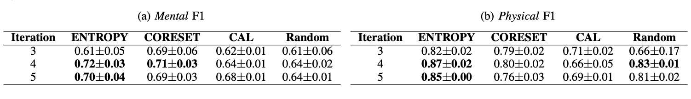
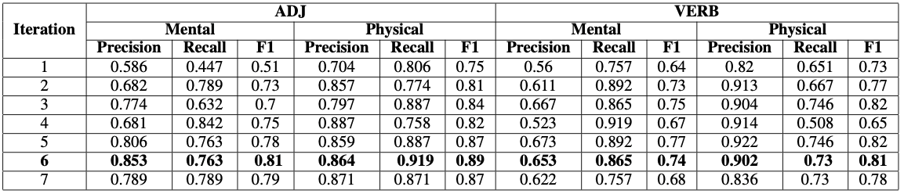

# Mental and Physical Classification

Classify a semantic concept as **Mental** or **Physical**. Mental concepts relate to mental activities, which fall into six categories: `Emotion, Need, Perceiving, Reasoning, Planning and Personality`. Physical concepts describe physical attributes of an object, like color, hardness, speed and malleability. In short, we name this inference task as MPC.

# Word-Level Inference

Implement MPC at word-level. We propose an active learning framework to train a BERT model with very low annotation resources. Four active learning strategies are compared: **Entropy**, **CORESET**, **CAL** and **RANDOM**.

We use Amazon Fine Food Reviews as corpus, and total 7,292 adjectives are extracted out for inference. Inferred result with Entropy strategy is [infer_mental_adj.json](infer_mental_adj.json).

### Performance

The below table shows averaged `F1 scores` after 3,4,5 iterations. **ENTROPY** outperforms the other three, achieving the highest Mental F1 **0.72** and Physical F1 **0.87** at iteration 4. The BERT checkpoint of ENTROPY at iteration 4 is used in the final inference pipeline.

ENTROPY requires only **60~70** labeled words for training per iteration, which means totally around **300** samples are needed to deliver an applicable classifier.

### Limitation

If an word bears mental and physical senses simultaneously, the word-level method would fail. In this case, sense-level method is needed.

### Reference

TBA.

# Sense-Level Inference

MPC task is implemented directly on a word's senses, whose definition is provided by WordNet. Currently, we focus only on adjectives and verbs in WordNet. Nouns are not included as they have perfect hierarchical organization in WordNet. The best inference result is [ment_phy_net_v2.csv](sense_level/ment_phy_net_v2.csv).

### Performance
In each iteration, 20 positive and 20 negative samples with highest entropy are selected from adjectives and verbs. The below table shows `Precision, Recall and F1 scores` at each iteration. Overall, **iteration 6** achieves the best performance. The BERT checkpoint at iteration 6 is used in the final inference pipeline.

